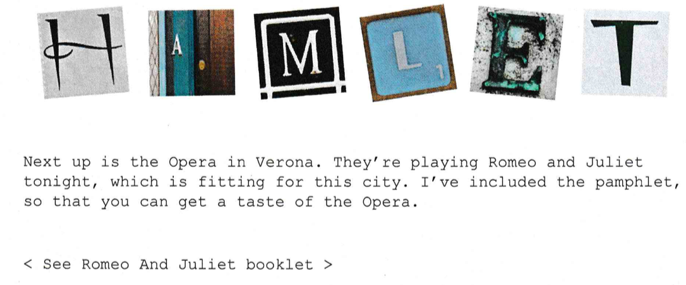
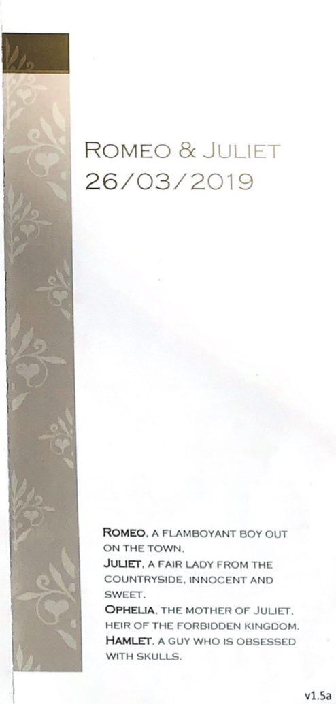

# Hamlet

### [-$ cd ..](../)

For this challenge, we received the following documents:

We started to read the text and did not find at the first time. After a while, we suspected that it could be a `Shakespeare Programming Language`.
We used a [website](https://www.onlineocr.net/fr/) to proceed some OCR on the documents to extract the text.

We were then able to encode the [extracted text](./assets/romeo_juliette.txt) into a [Shakespeare Programming Language interpreter](https://tio.run/#spl) where we obtained the following output `ToBeOrTwoBeer`
