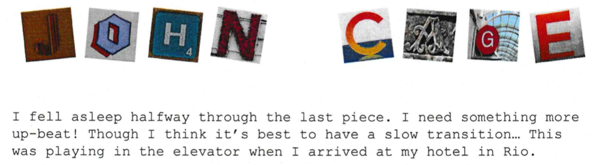
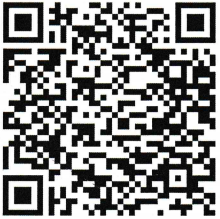

# John Cage

### [~$ cd ..](../)

Author [Renaud11232](https://renaud11232.github.io/)



For this challenge, we were given a sheet of paper with a QR code and asked to find a two words flag :



Once scanned using our phones it got us to an URL where we could download an [`mp3` file](assets\c456367b0382ef71aae436a0675701a8.mp3).

Knowing this challenge "could" be solved on our phone, we didn't bother opening our full suite of audio steganography tools and whatnots.

After earing the song, we noticed the drums sounded quite off, and finally had to idea that the drums could be morse code with :
* `kicks` being `dots`
* `hats` being `dashes`

And sure enough, after translating from `drums` to `morse` we got:

```
-- .. -.-. .... .- . .-.. .-.. ..- -.. .-- .. --.
```

Once decoded to text :

```
MICHAELLUDWIG
```

With a space added, because we were looking for two words :

```
MICHAEL LUDWIG
```

DONE
