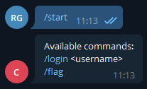
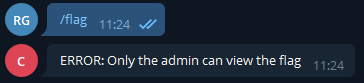
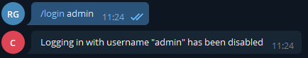
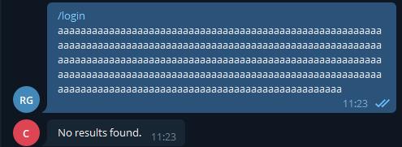
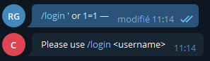
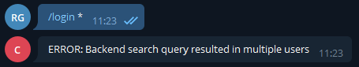
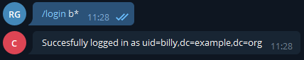
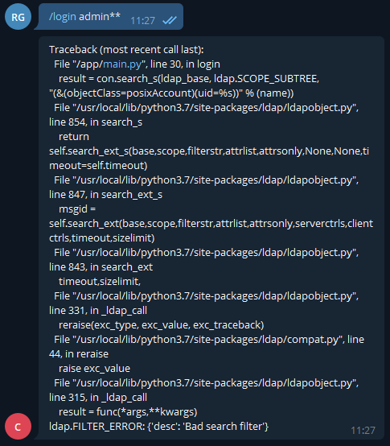
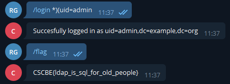

# Password

### [~$ cd ..](../)

Author [Renaud11232](https://renaud11232.github.io/)

For this challenge, we were given a sheet of paper with some story about the challenge with `telegram://CSCBEBot` written on it.


So we installed `Telegram` and joined the bot and were greeted with :



So one of the first things we tried was just `/flag`. You never know :).



Then we tried logging in as the admin :



Sadly, but expectedly it didn't work.
We also tried some very crude buffer overflows.



SQL injections :



Then we tried logging in as `*` to see what would happen.



We were onto something. We tried logging in as `admin*`, sadly there was still more than 1 result, then we tried `/login b*`:



Now from here we were pretty sure we were talking to a bot with an `LDAP` injection vulnerability. The only missing piece was to know how the requests were made.

And after a bit of tinkering we just tried with `**`



So we knew how our input was concatenated into the filter :

```python
"(&(objectClass=posixAccount)(uid=%s))" % (name)
```

`&` is a `and`. So one way of logging in as the admin was to filter `posixAccount`s `all` of them then only filter the `admin` one:

```
(&(objectClass=posixAccount)(uid=*)(uid=admin))
```


DONE
