# Rosetta

### [~$ cd ..](../)

Author [Renaud11232](https://renaud11232.github.io/)


For this challenge, we were given a sheet of paper with some cryptograms :

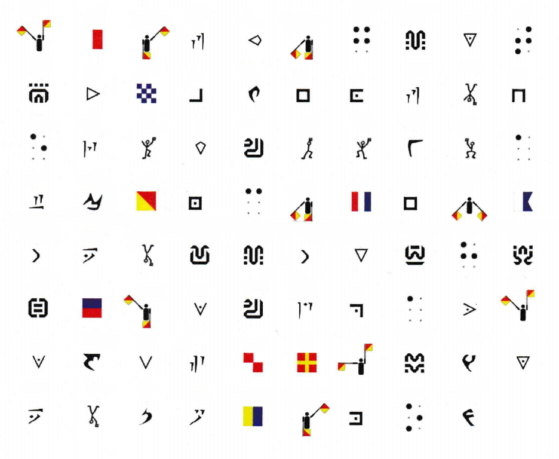

We knew a few of these but not most of them so we went to [dCode.fr](http://www.dcode.fr) to find the missing substitution alphabets.

Here is the list of all alphabets in this text by order of appearance :

* Flag Semaphore :

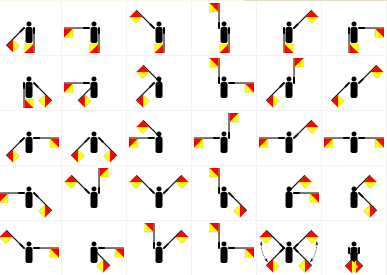

* Maritime Signals Code :

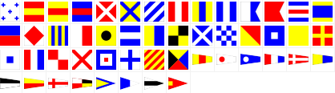

* Draconic Language :

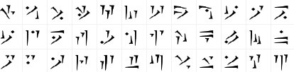

* Templar Cipher :

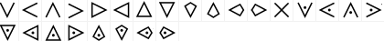

* Braille Alphabet :

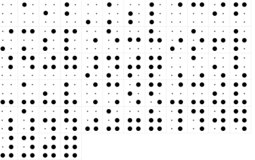

* Sheikah Language :

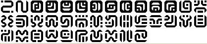

* Pigpen Cipher :

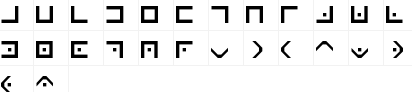

* Klingon Language :

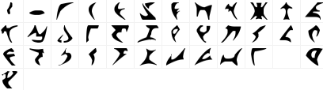

* Dancing Man Cipher :

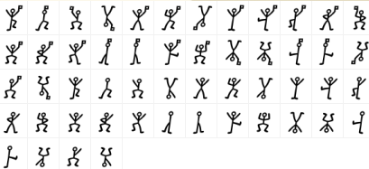

Once everything was decoded we could read (with added spaces) :

```
THE FLAG IS THE NAME OF THE RAINBOW CAT CONCATENATED WITH THE SECOND PART OF THE SURPRISED POKEMON
```

The rainbow cat is the `nyan` cat :


And the surprised pokemon had to be Pikachu :

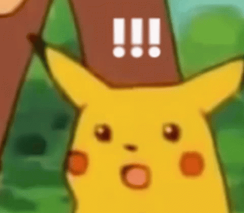

So the flag was :

```
nyanchu
```

DONE
